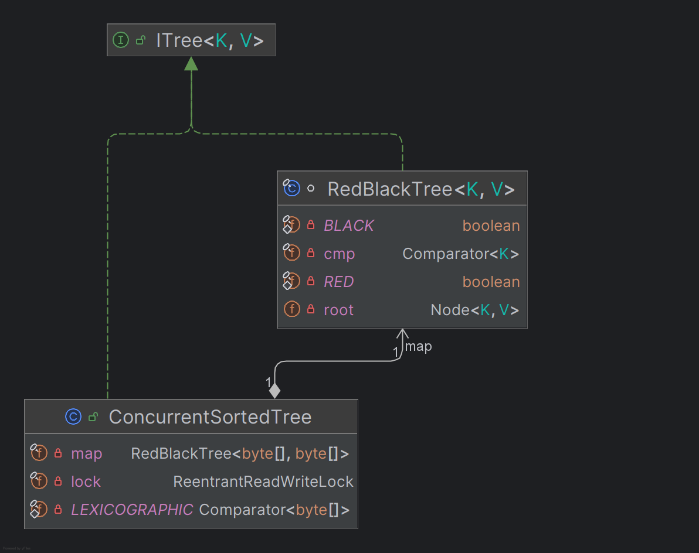

# 🌳 CST - ConcurrentSortedTree


 


This is my solution to JetBrains YouTrackDB development internship project. It features a custom implementation of a concurrent, sorted in-memory tree (Red-Black Tree) with put and get methods, where keys and values are byte arrays.

---

## 🎥 Demo Video

Checkout my youtube video explaining the whole project in a nutschell:

[](https://www.youtube.com/watch?v=7qZQMDii-ms)

---

## 🖼 UML Diagram

Here is a UML diagram illustrating the core classes and their relationships in the project.



---

## 📖 Overview

**ConcurrentSortedTree** is a Java-based, thread-safe, sorted in-memory tree.

- **Key/Value Type:** `byte[]`
- **Operations:**
  - `get(byte[])` → Retrieve value by key.
  - `put(byte[], byte[])` → Insert/update value by key; returns previous value if replaced.

**This repository includes:**

- ✅ Core Red-Black Tree implementation in the `cst` package.
- ✅ **Demo application:** `Example.java` simulates an issue tracker and validates concurrency.
- ✅ **Optional REST Controller:** `DBserver.java` (Spring Boot) exposes a simple API for the database.
- ✅ **JUnit tests:** Thorough correctness and concurrency validation.
- ✅ **Benchmarks:** Performance measurement utilities.

---

## 🧩 Why a Red-Black Tree?

The core of this project is a **handwritten Red-Black Tree** wrapped around **'ConcurrentSortedTree'** supporting concurrent access via a `ReentrantReadWriteLock` .

### Red-Black Tree
- Provides a **sorted structure** with `O(log n)` complexity for `get`/`put`.
- Implemented from scratch for full control.

### Custom Comparator
- Java arrays are compared by reference by default.
- Lexicographic, **unsigned comparator** (`a[i] & 0xFF`) ensures correct byte-wise ordering.

### ReentrantReadWriteLock
- Multiple readers (`get`) work concurrently.
- Writers (`put`) acquire the write lock exclusively.
- **Improved concurrency** over coarse `synchronized` blocks.

### Defensive Copying
- Keys/values are **copied on insert/retrieval**.
- Prevents external mutation, ensuring thread safety.

---

## 🧑‍💻 Wrapper Pattern Design

The **Wrapper (Decorator) pattern** is central to the architecture of this project. The core Red-Black Tree is implemented as a non-thread-safe, high-performance sorted data structure, focusing solely on correctness and efficiency. To enable safe concurrent access, the `ConcurrentSortedTree` class acts as a wrapper around the Red-Black Tree, layering in concurrency control without modifying the underlying tree logic.

This design allows separation of concerns:
- The Red-Black Tree only handles data organization and sorting.
- The wrapper (`ConcurrentSortedTree`) manages synchronization using a `ReentrantReadWriteLock` for thread safety.

With this pattern, the concurrency logic is cleanly separated from the tree’s algorithm, promoting maintainability and extensibility. It also allows the core data structure to be reused in both concurrent and single-threaded contexts by choosing the appropriate wrapper.

---

## ✨ Features

- 🔒 **Thread-safe** concurrent access
- ⚡ **Sorted** storage (custom Red-Black Tree)
- 🎯 **Minimal API**: `get`, `put`
- 🧪 **Unit & concurrency tests**
- 🌐 **Optional REST API** (Spring Boot)
- 🛠 **Utility helpers** (`Utf8` conversions, etc.)

---

## 🛠 Technologies

| Tech         | Use Case         |
|--------------|------------------|
| ☕ Java 17+    | Core language    |
| 🛠 Gradle     | Build tool       |
| ✅ JUnit      | Testing          |
| 🚀 Spring Boot| REST API (optional) |

---

## ⚙️ Setup

### 1. Clone the Repository

```sh
git clone https://github.com/roman-kupar/ConcurrentSortedTree.git
cd ConcurrentSortedTree
```

---

## 🚀 Quick Start

1. **Build & Test**
   ```sh
   ./gradlew build
   ./gradlew test
   ```

2. **Run Demo Application**
   ```sh
   java -cp build/classes/java/main org.example.Example
   ```

3. **Run Benchmark**
   ```sh
   java -cp build/classes/java/main org.example.TreeBenchmark
   ```

4. **Run Comparison**
   ```sh
   java -cp build/classes/java/main org.example.Comparison
   ```

5. **Start REST API (optional)**
   ```sh
   java -cp build/classes/java/main org.example.DBserver
   ```
   or (if using Spring Boot)
   ```sh
   ./gradlew bootRun
   ```

---

## 📡 REST API Usage Examples

### Using curl

- **PUT (insert/update a value):**
  ```sh
  curl -X POST http://localhost:8080/db/put \
    -H "Content-Type: application/json" \
    -d '{"key":"myKey","value":"myValue"}'
  ```
  - Response: previous value for the key (or "null" if none)

- **GET (retrieve a value):**
  ```sh
  curl http://localhost:8080/db/get/myKey
  ```
  - Response: value for the key (or 404 if not found)

### Testing POST request in Postman
1. Open Postman and create a new request.
2. Set the method to **POST** and the URL to `http://localhost:8080/db/put`.
3. Go to the **Body** tab, select **raw**, and choose **JSON** from the dropdown.
4. Enter the following JSON:
   ```json
   {
     "key": "myKey",
     "value": "myValue"
   }
   ```
5. Click **Send**. You should see the previous value (or "null") in the response.

### Testing GET request in Postman
1. Open Postman and create a new request.
2. Set the method to **GET** and the URL to `http://localhost:8080/db/get/myKey` (replace `myKey` with your actual key).
3. Click **Send**. You should see the value for the key in the response, or a 404 if not found.

---

## ⚡ CI/CD: GitHub Actions Workflow

This project uses **GitHub Actions** for continuous integration. Every push and pull request to the `main` branch triggers the workflow, which automatically:

- Checks out the code
- Sets up Java 17
- Caches Gradle dependencies for faster builds
- Builds the project and runs all unit tests

You can find the workflow file at `.github/workflows/gradle.yml`.

**How it works:**
- If any test fails, the build will fail and you’ll see details in the GitHub Actions tab of your repository.
- Test reports are available in `build/reports/tests/test/index.html` after a local build.

---

